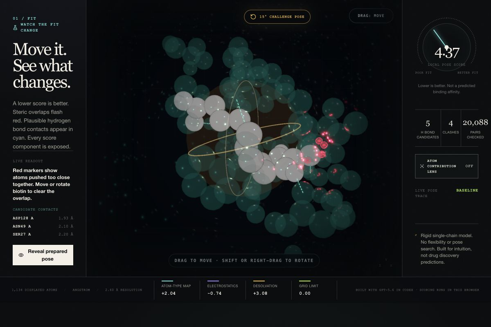

# SNAP

**Grab a real small molecule, fit it into a prepared protein pocket, and watch an authentic AutoGrid4 pose score respond in real time.**

SNAP turns a static molecular-recognition diagram into a falsifiable browser instrument. It ships two pinned AutoDock-GPU benchmarks: streptavidin–biotin from PDB 1STP and c-MET kinase with experimental inhibitor 1FN from PDB 3CE3. Move either rigid ligand, inspect candidate contacts and steric overlaps, then reveal its prepared co-crystal input pose. The same browser engine samples a separate target-specific field for each system. An optional atom contribution lens colors the ligand by current-minus-challenge score changes and verifies, at displayed precision, that the atom deltas sum back to the pose delta. A blind transfer lab then exposes a counterintuitive 3CE3 result: the local score improves even though candidate-contact count falls.

SNAP was conceived and built during OpenAI Build Week; the public repository history begins July 21, 2026.

The score runs entirely in the browser. There is no API call, server calculation, account, paid credit, or model in the interaction loop.

The intended audience is preclinical pharmacology, medicinal-chemistry, and molecular-biology learners and educators. An instructor can share one URL, ask for a prediction, and use the controlled reveal plus second-target counterexample as a discussion experiment without an install or account.

**[Open the public instrument](https://snap-binding.sammsamy.chatgpt.site)** · **[Run the 10-minute educator lesson](EDUCATOR_GUIDE.md)** · **[Inspect the public repository](https://github.com/Sammsamy/snap)**



*Actual 1200 × 800 browser state from the deployed instrument; no molecule or readout is composited into this screenshot.*

## What the demo demonstrates

SNAP is not a distance-to-answer trick. Each ligand atom samples the official target-specific AutoGrid maps with x-fast trilinear interpolation:

```text
atom-type affinity map + q × electrostatics map + |q| × desolvation map
```

Lower scores are more favorable only within one fixed prepared system. Scores from different targets are on target-specific fields and must not be compared as affinity or binding strength.

### 1STP · streptavidin / biotin

| Audited pose | AutoGrid4 local pose score |
| --- | ---: |
| Prepared co-crystal input pose | **−8.974** |
| Translate +0.5 Å on x | −4.674 |
| Rotate 15° around z | +4.371 |
| Rotate 20° around z | +3.536 |

The prepared input beats these disclosed controls and sits in a favorable local basin under this model. That does **not** prove a global optimum and does not predict biological affinity.

### 3CE3 · c-MET / experimental inhibitor 1FN

| Audited pose | AutoGrid4 local pose score |
| --- | ---: |
| Prepared co-crystal input pose | **−11.644** |
| Translate −1 Å on x | −0.090 |
| Translate +1 Å on z | +3.034 |
| Rotate 15° around z | +145.802 |

The 3CE3 controlled path changes from `+145.80 / 17 clashes / 4 candidate contacts` to `−11.64 / 1 clash / 3 candidate contacts`. Losing a candidate contact while the authentic grid score improves is useful evidence that contact count does not determine the score.

## Judge path

1. Press **Start fitting**.
2. See the disclosed 15° challenge pose begin at approximately +4.37 with visible clash markers.
3. Drag the bright biotin molecule or use the arrow keys, then watch the score, live pose trace, candidate contact residues, distances, and clashes update.
4. Turn on **Atom contribution lens**. The three largest modeled per-ligand-atom changes are exposed, and a rounding-aware conservation line verifies `Σ atom Δ = pose Δ` at displayed precision.
5. Load the exact challenge pose, then run the controlled **Predict → Reveal → Explain** task before inspecting the answer elsewhere.
6. See the molecule converge on the prepared co-crystal input and the score settle at approximately −8.97.
7. Receive a local task receipt, then lock a blind prediction about whether candidate-contact count will rise, stay level, or fall on the second target.
8. Open **3CE3 · c-MET kinase · 1FN**, run the same controlled reveal, and inspect the target-local `+145.80 → −11.64`, `17 → 1` overlap, and `4 → 3` candidate-marker result.
9. Read the counterexample: candidate-marker count fell while the AutoGrid score improved, so the separate geometry overlay cannot determine the scorer.

Keyboard controls are built in: arrows translate, Page Up/Page Down move in depth, Shift + arrows rotate, and Q/E roll. The stage respects reduced-motion preferences.

The learning task captures one deterministic comparison for the selected target: the exact 15° reset pose to the locked prepared reference. It grades the prediction against the score and clash changes that actually occurred. After a 1STP receipt, the blind transfer lab can lock one immutable candidate-contact prediction before 3CE3 is viewed or completed; selecting 3CE3 first permanently disables the blind path for that page session. Its first controlled result is retained even if the task is rerun. A page-memory observation record can retain one labelled receipt per target while the page remains open; it clears on refresh, transmits nothing, never combines the target-specific scores, and is explicitly not evidence of competence, learning efficacy, or clinical validation.

The contribution lens is equally bounded. It reports each ligand atom's change in AutoGrid map, electrostatic, and desolvation contributions relative to that target's disclosed challenge pose. It does not assign energies to receptor residues, predict affinity, or compare targets. The implementation fails closed unless every atom is inside the grid and all per-atom term sums conserve the scorer-owned total within a rounding-aware tolerance.

## Scientific boundary

SNAP is a rigid-pose interaction instrument for intuition and education. It is not a docking search, affinity predictor, molecular-dynamics engine, or clinical tool.

No physician review or clinical validation was performed. SNAP makes no diagnostic, treatment, safety, or efficacy claim.

- Receptor and ligand are rigid in both systems.
- There is no conformational search, minimization, or torsional optimization.
- Protonation, AutoDock atom types, and Gasteiger partial charges are prepared inputs.
- The benchmark preparation uses a deprotonated biotin carboxylate.
- The maps use implicit solvent and omit explicit water dynamics, polarization, receptor entropy, and protein motion.
- The official AutoDock-GPU benchmark maps contain deposited chain A only. The biological tetramer and its intersubunit contacts are omitted from the score.
- The neighboring tetramer-contact Trp120 residue and nearby crystallographic waters are documented as unscored context, not included in the displayed or scored atom model.
- Candidate H-bonds and clashes come from a separate bounded geometric explanation layer. They do not alter the authentic AutoGrid total.
- If any ligand atom leaves the prepared grid, the UI shows an out-of-grid state rather than presenting the guard penalty as physical energy.
- 1FN is an experimental inhibitor, not an approved medicine or treatment recommendation. Its five source torsions remain frozen.
- Three 1FN polar hydrogens are prepared inputs rather than experimental heavy-atom coordinates. Its 41 inferred bonds are display-only and never enter scoring.
- One bounded geometric clash marker remains at the prepared 3CE3 pose. That separate overlay is not part of the AutoGrid total and does not imply the experimental heavy-atom pose is wrong.
- Target assets are static and load on selection. After a selected target loads, all pose scoring stays local; switching to an uncached target requires downloading its static JSON/grid assets.

Biotin is a small molecule and canonical binding model, not a drug. 1FN is an experimental inhibitor. SNAP teaches pose-level reasoning; it does not evaluate efficacy, safety, or clinical use.

## Architecture

```text
Pinned public structures + official benchmark maps
                    ↓
       reproducible offline preparation
                    ↓
 prepared atoms + target-specific 8-channel Float32 grids
                    ↓
      browser trilinear scorer (scorer-owned total)
                    ↓
 per-ligand-atom delta lens + conservation check
                    ↓
 bounded pair geometry (visual explanation only)
                    ↓
 Three.js 6-DOF stage + score dial + prepared-pose reveal
```

Important files:

- `app/lib/scoring.ts` — rigid transforms, exact AutoGrid interpolation, and bounded explanation geometry.
- `app/lib/contributionLens.ts` — same-system atom deltas, fail-closed validation, stable driver ranking, and rounding-aware conservation checks.
- `app/components/MolecularStage.tsx` — instanced molecular rendering, drag/rotate controls, contacts, pocket glow, and reduced-motion support.
- `app/components/SnapExperience.tsx` — asset hydration, scoring policy, reveal animation, audio cue, and explanatory UI.
- `app/components/TwoTargetObservationRecord.tsx` — page-memory, target-labelled task receipts with no score aggregation or persistence.
- `app/components/ContactCountTransferLab.tsx` — immutable blind contact-count prediction, fail-closed 3CE3 result capture, and the target-local counterexample panel.
- `scripts/prepare_1stp.py` — reproducible public-data preparation.
- `scripts/validate_1stp_assets.py` — hashes, coordinate checks, binary/JSON parity, and reference/decoy score checks.
- `VIDEO_SCRIPT.md`, `SUBMISSION.md`, and `JUDGE_QA.md` — the recording script, Devpost copy, release checklist, and hostile-question guardrails.
- `EDUCATOR_GUIDE.md` — a ready-to-run 10-minute lesson, answer key, extension, and honest future-pilot protocol.
- `public/data/1stp-biotin.json` — centered prepared atoms, reference pose, provenance, scope, and limitations.
- `public/data/1stp-autogrid.f32` — compact 8-channel Float32 grid used at runtime.
- `public/data/1stp-autogrid-runtime.json` — compact runtime metadata for the binary grid, without duplicated map values.
- `public/data/1stp-autogrid.json` — inspectable map values, per-channel hashes, and validation record.
- `public/data/3ce3-system.json` — compact c-MET/1FN prepared system, frozen-pose boundary, and exact control panel.
- `public/data/3ce3-autogrid.f32` and `3ce3-autogrid-runtime.json` — the second target's eight-channel runtime grid and manifest.
- `tests/second-system.test.ts` — public-file hashes, channel layout, all-atoms-in-grid checks, and exact four-pose 3CE3 verification.
- `tests/contribution-lens.test.ts` — atom identity/order checks, cross-system rejection, accessible tone mapping, ranking, and conservation invariants.
- `tests/two-target-observation-record.test.ts` — target-safe upserts, both completion orders, wrong-response retention, accessible markup, and no-storage checks.
- `tests/contact-transfer-lab.test.ts` — blind-result withholding, exact 3CE3 deltas, first-attempt immutability, fail-closed path validation, and overclaim boundaries.
- `research/second-system/` — pinned upstream inputs, preparation/build scripts, manifests, licenses, and independent release-candidate verifiers for 3CE3.

## Run locally

Prerequisite: Node.js 22.13 or newer.

```bash
npm install
npm run dev
```

Open `http://localhost:3000`.

Run every current verification:

```bash
python3 scripts/validate_1stp_assets.py
npm test
npm run lint -- --max-warnings=0
```

`npm test` runs the deterministic scoring tests, produces a release build, verifies the server-rendered product shell, and audits the shipped scientific contracts.

## GPT-5.6 and Codex collaboration

SNAP was built in Codex with GPT-5.6. The model was used during development, not as a paid runtime dependency.

Codex helped me:

- audit the Build Week rules and remove an unnecessary runtime API plan;
- find and pin the official AutoDock-GPU 1STP and 3CE3 benchmarks instead of inventing molecular parameters;
- write the reproducible preparation and independent validator;
- implement and test x-fast trilinear map scoring and quaternion pose transforms;
- build the Three.js interaction stage, keyboard access, reduced-motion behavior, and responsive interface;
- design and adversarially test the controlled predict–reveal–explain task;
- derive and test a per-ligand-atom contribution lens whose deltas conserve every displayed score term;
- turn the two guided tasks into one coherent page-memory observation record and a blind contact-count transfer check without implying mastery or learning efficacy;
- run separate science, licensing, hostile-judge, copy, and live-browser audits;
- catch the single-chain biological-assembly limitation, an interpolation-boundary mismatch, false clash labels, and a misleading cross-target visual scale before release.

Codex session ID for the Build Week collaboration:

```text
019f48c7-345a-70d3-bf51-81bbc847143b
```

## Data, provenance, and licensing

SNAP is released as a whole under **GPL-2.0-or-later**. See [`LICENSE`](LICENSE) and [`NOTICE`](NOTICE).

- RCSB PDB coordinate data are provided under the [RCSB PDB usage policy / CC0](https://www.rcsb.org/pages/usage-policy).
- AutoDock-GPU benchmark PDBQT/map assets are pinned to commit `89fd1c5e6b4639c22e9a2bea4cc805c42347fffb` and conservatively redistributed under the upstream repository's GPL-2.0-or-later terms.
- Exact source paths, SHA-256 hashes, copyright/trademark notices, no-endorsement language, and the upstream license are in [`public/data/THIRD_PARTY_DATA.md`](public/data/THIRD_PARTY_DATA.md).
- [`public/snap-social.png`](public/snap-social.png) is an illustrative promotional image generated with OpenAI's image tool during Build Week. It is not a rendering of PDB 1STP and is not used by the scientific instrument.
- SNAP is independent and is not affiliated with or endorsed by the AutoDock authors, TU Darmstadt, CCSB Scripps, the Scripps Research Institute, or RCSB PDB.

## Primary references

- Morris, G. M., et al. AutoDock4 and AutoDockTools4. *Journal of Computational Chemistry* (2009). [DOI](https://doi.org/10.1002/jcc.21256)
- Huey, R., et al. A semiempirical free energy force field with charge-based desolvation. *Journal of Computational Chemistry* (2007). [DOI](https://doi.org/10.1002/jcc.20634)
- [AutoDock-GPU](https://github.com/ccsb-scripps/AutoDock-GPU)
- [RCSB PDB 1STP](https://www.rcsb.org/structure/1STP)
- [RCSB PDB 3CE3](https://www.rcsb.org/structure/3CE3)

## Current release state

The implementation, local verification, public repository, public deployment, and audited narrated video master are complete. Public YouTube upload, `/feedback` ID verification, authenticated-form audit, and final Devpost submission remain separate release gates and have not been represented as complete here.
